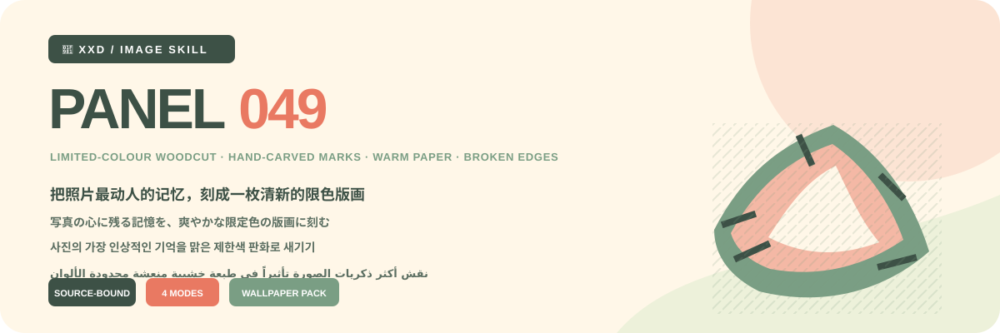
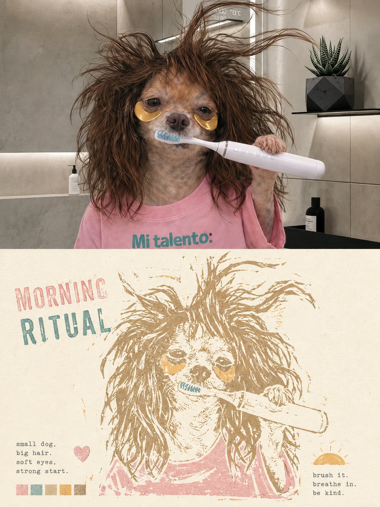
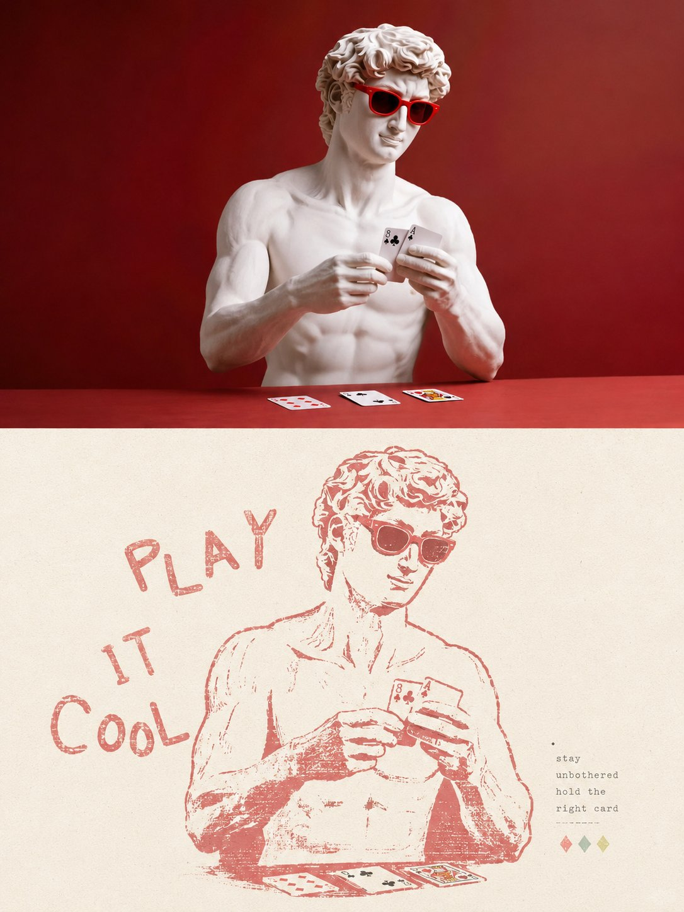
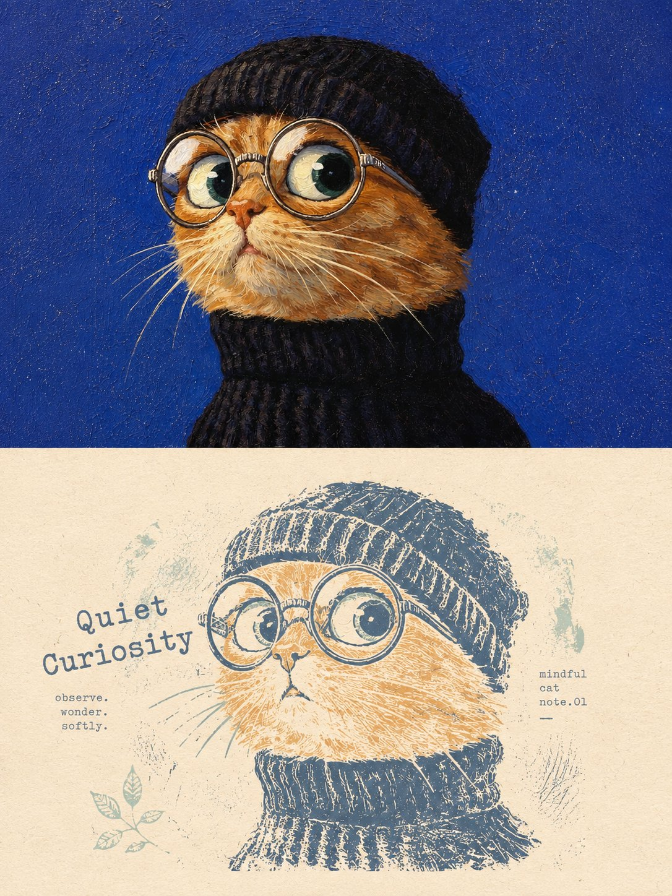
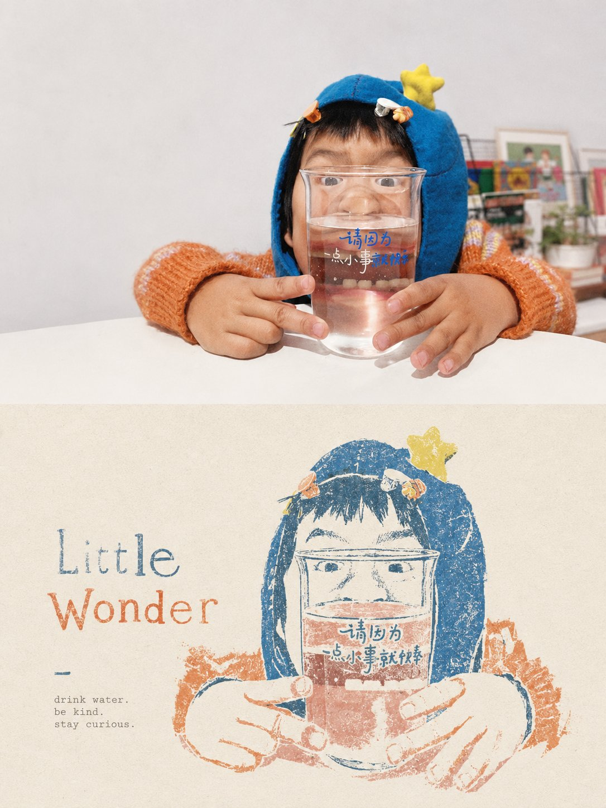

<p align="center"></p>

<div align="center" dir="rtl">

# 🦁 XXD Panel 049

### نقش أكثر ذكريات الصورة تأثيراً في طبعة خشبية منعشة محدودة الألوان

[简体中文](README.md) · [English](README.en.md) · [日本語](README.ja.md) · [한국어](README.ko.md) · **العربية**

</div>

<div dir="rtl">

> نقش خشبي محدود الألوان · آثار حفر يدوية · حبر مطفأ · ورق دافئ · حواف غير مكتملة

يحذف XXD Panel 049 الخلفية المعقدة والتفاصيل الصغيرة عمداً، ثم يعيد بناء المحيط والنسب والاتجاهات وكتل الظل والبنية والعلاقات التي تحمل التعرّف والعاطفة كأثر نقش خشبي أو لينوليوم عائم على ورق دافئ.

## الدافع الجمالي

تُثبَّت الهوية والصورة الظلية والاتجاه والعلاقة الشعورية، وتُحفظ ثلاث علامات خاصة بالمصدر على الأقل. يُختزل الموضوع إلى محيط قابل للحفر وكتل حبر وفراغ سلبي، ثم يُطبع بعدد قليل من الأحبار المطفأة المضيئة. ويتبع نقص الحبر والانقطاع وظهور الورق واختلال التسجيل وتآكل الحواف شكل الموضوع، لا طبقة تعتيق موحدة. تُرفض الخطوط المتجهية الملساء، والرسوم الكرتونية، والإطارات المستطيلة الكاملة، والقدم الداكن الثقيل، وقوالب ملصقات السفر.

المواصفات: [Skill](SKILL.md) · [النص الأصلي](references/049-source.md) · [مهايئ التشغيل الإنجليزي](references/xxd-panel-049-prompt.en.md) · [مهايئ التشغيل الصيني](references/xxd-panel-049-prompt.zh-CN.md)

## النماذج · من X

> [Xiaoxiaodong (@xiaoxiaodong01)](https://x.com/xiaoxiaodong01/status/2091453089954070791) · 23 أغسطس 2026<br>
> GPT2 × طباعة فنية × إحساس دافئ × توجيه جمالي × VOL.049

<table>
  <tr>
    <td width="50%"><a href="https://x.com/xiaoxiaodong01/status/2091453089954070791"></a></td>
    <td width="50%"><a href="https://x.com/xiaoxiaodong01/status/2091453089954070791"></a></td>
  </tr>
  <tr>
    <td width="50%"><a href="https://x.com/xiaoxiaodong01/status/2091453089954070791"></a></td>
    <td width="50%"><a href="https://x.com/xiaoxiaodong01/status/2091453089954070791"></a></td>
  </tr>
</table>

<p align="center"><a href="https://x.com/xiaoxiaodong01/status/2091453089954070791">عرض المنشور الأصلي والتوجيه كاملاً ←</a></p>

تعرض هذه النماذج الدافع الجمالي للإصدار 049 فقط؛ ولا تصبح موضوعاتها أو تكوينها أو ألوانها أو نصوصها أو نسبة اللوحة السابقة مراجع للتوليد أو إعدادات افتراضية حالية.

## الموجّه الأصلي هو المرجع الجمالي الوحيد

الملف `references/049-source.md` هو المرجع الإبداعي والجمالي الوحيد للمشروع. لا تلخّص المهارة نصّه ولا توسعه، ولا تفرض لوحة ألوان مشتركة أو «دافعاً جمالياً» أو عنواناً أو حزمة نصوص قصيرة. يتبع GPT Image 2 قواعد الموجّه الأصلي نفسه في اللون والخامة والتكوين والفراغ والنص والطباعة.

لا يغيّر النمط والحجم إلا حاوية العرض القديمة 3:4 ذات الجزأين العلوي والسفلي. في النمط الأفقي يُنقل «الصورة العليا／التصميم السفلي» إلى اليسار／اليمين، وفي نمط التصميم وحده والخلفيات يمتد منطق التصميم السفلي إلى اللوحة كاملة. تبقى كل تعليمات الموجّه الأخرى فعّالة.

## الموجّه الأصلي هو المرجع الجمالي الوحيد

الملف `references/049-source.md` هو المرجع الإبداعي والجمالي الوحيد للمشروع. لا تلخّص المهارة نصّه ولا توسعه، ولا تفرض لوحة ألوان مشتركة أو «دافعاً جمالياً» أو عنواناً أو حزمة نصوص قصيرة. يتبع GPT Image 2 قواعد الموجّه الأصلي نفسه في اللون والخامة والتكوين والفراغ والنص والطباعة.

لا يغيّر النمط والحجم إلا حاوية العرض القديمة 3:4 ذات الجزأين العلوي والسفلي. في النمط الأفقي يُنقل «الصورة العليا／التصميم السفلي» إلى اليسار／اليمين، وفي نمط التصميم وحده والخلفيات يمتد منطق التصميم السفلي إلى اللوحة كاملة. تبقى كل تعليمات الموجّه الأخرى فعّالة.

## الموجّه الأصلي هو المرجع الجمالي الوحيد

الملف `references/049-source.md` هو المرجع الإبداعي والجمالي الوحيد للمشروع. لا تلخّص المهارة نصّه ولا توسعه، ولا تفرض لوحة ألوان مشتركة أو «دافعاً جمالياً» أو عنواناً أو حزمة نصوص قصيرة. يتبع GPT Image 2 قواعد الموجّه الأصلي نفسه في اللون والخامة والتكوين والفراغ والنص والطباعة.

لا يغيّر النمط والحجم إلا حاوية العرض القديمة 3:4 ذات الجزأين العلوي والسفلي. في النمط الأفقي يُنقل «الصورة العليا／التصميم السفلي» إلى اليسار／اليمين، وفي نمط التصميم وحده والخلفيات يمتد منطق التصميم السفلي إلى اللوحة كاملة. تبقى كل تعليمات الموجّه الأخرى فعّالة.

## الموجّه الأصلي هو المرجع الجمالي الوحيد

الملف `references/049-source.md` هو المرجع الإبداعي والجمالي الوحيد للمشروع. لا تلخّص المهارة نصّه ولا توسعه، ولا تفرض لوحة ألوان مشتركة أو «دافعاً جمالياً» أو عنواناً أو حزمة نصوص قصيرة. يتبع GPT Image 2 قواعد الموجّه الأصلي نفسه في اللون والخامة والتكوين والفراغ والنص والطباعة.

لا يغيّر النمط والحجم إلا حاوية العرض القديمة 3:4 ذات الجزأين العلوي والسفلي. في النمط الأفقي يُنقل «الصورة العليا／التصميم السفلي» إلى اليسار／اليمين، وفي نمط التصميم وحده والخلفيات يمتد منطق التصميم السفلي إلى اللوحة كاملة. تبقى كل تعليمات الموجّه الأخرى فعّالة.

## الموجّه الأصلي هو المرجع الجمالي الوحيد

الملف `references/049-source.md` هو المرجع الإبداعي والجمالي الوحيد للمشروع. لا تلخّص المهارة نصّه ولا توسعه، ولا تفرض لوحة ألوان مشتركة أو «دافعاً جمالياً» أو عنواناً أو حزمة نصوص قصيرة. يتبع GPT Image 2 قواعد الموجّه الأصلي نفسه في اللون والخامة والتكوين والفراغ والنص والطباعة.

لا يغيّر النمط والحجم إلا حاوية العرض القديمة 3:4 ذات الجزأين العلوي والسفلي. في النمط الأفقي يُنقل «الصورة العليا／التصميم السفلي» إلى اليسار／اليمين، وفي نمط التصميم وحده والخلفيات يمتد منطق التصميم السفلي إلى اللوحة كاملة. تبقى كل تعليمات الموجّه الأخرى فعّالة.

## أربعة مخرجات قابلة للجمع

يمكن اختيار واحد أو أكثر من `top-bottom` و`left-right` و`design-only` و`wallpaper-pack`. تُولَّد اللوحة المزدوجة كصورة نهائية كاملة افتراضياً؛ ولا يُستخدم الدمج الحتمي إلا بعد فشل إعادة المحاولة، أو للحفاظ الحرفي على بكسلات المصدر، أو لمعايرة الحجم بلا فقد.

يمكن أيضاً اختيار عدة أحجام: ملاءمة تلقائية، نسبة المصدر، 1:1، 3:4، 4:3، 4:5، 5:4، 2:3، 3:2، 9:16، 16:9، 21:9، 5:7، 7:5، أو نسبة مخصصة／أبعاد بكسل دقيقة. لا يوجد حجم افتراضي صامت، وتُعاد صياغة كل نسبة مختلفة بصورة مستقلة من الموجّه الأصلي نفسه.

حزمة الخلفيات إما مترابطة أو مستقلة. في الحزمة المترابطة تُنشأ صورة مرجعية أولى، ثم يُعاد تكوين كل جهاز من المصدر الأصلي مع تلك الصورة؛ ولا تُقص صورة واحدة آلياً إلى أربعة أحجام.

## أوضاع النص

قبل التوليد يُحسم خيار واحد:

1. **ينشئ النموذج النص وفق الموجّه الأصلي**: يحدد المستخدم اللغة أو المنطقة فقط، ويتبع GPT Image 2 منطق الموجّه في المحتوى والكمية والنبرة والطباعة.
2. **استخدام نصي الحرفي**: يُمرر كما هو بلا إعادة صياغة أو ترجمة أو عنوان إضافي، مع بقاء الطباعة خاضعة للموجّه الأصلي.
3. **بلا نص**: يُمنع كل نص أو شبه نص.

لا تكتب المهارة الخارجية عنواناً أو نصوصاً قصيرة مسبقاً. تُحسم لغة الإخراج مستقلة عن لغة الواجهة، ولا تُستنتج من الشخص أو المشهد أو اسم الملف.

## عناصر اختيار ومعاملات مضمنة

عندما توفّر بيئة التشغيل عناصر تفاعلية حقيقية، تفضّل المهارة بطاقات الاختيار: يمكن تحديد عدة أنماط وعدة مقاسات عادية، بينما يكون نمط النص وعلاقة الخلفيات اختياراً واحداً. تشمل المقاسات: الضبط التلقائي، ونسبة المصدر، و1:1 و3:4 و4:3 و4:5 و5:4 و2:3 و3:2 و9:16 و16:9 و21:9 و5:7 و7:5، إضافة إلى نسبة أو دقة مخصصة. وإذا لم تتوفر عناصر تفاعلية، تستخدم المهارة قائمة مرقمة واضحة متعددة الأسطر بدلاً من مربعات اختيار وهمية غير قابلة للنقر.

يمكن أيضاً تمرير كل الإعدادات كمتغيرات ضمن أمر الاستدعاء:

```text
/xxd-panel-049 photo.jpg --mode top-bottom,design-only --size auto,3:4,9:16 --text prompt --locale ja-JP
```

تشمل المعاملات `--mode` و`--size` القابل للتكرار أو الفصل بالفواصل، و`--text prompt|exact|none`، و`--locale`، و`--copy`، و`--wallpaper linked|independent`، و`--wallpaper-size`، و`--out`. عند اكتمال المعاملات تُتخطّى جميع أسئلة الإعداد ويبدأ التوليد مباشرة؛ وعند نقصها يُسأل فقط عن القيم الناقصة. تُعاد صياغة كل نسبة أبعاد بصورة مستقلة، وتبقى حزمة خلفيات الأجهزة الأربعة فرعاً مستقلاً لا يتضاعف آلياً مع المقاسات العادية.

## أولوية نموذج الصور

يظل GPT Image 2 الخيار الأول افتراضياً، مع الحفاظ على سير العمل الحالي: مرجع المصدر عالي الوفاء، وحسم اللوحة النهائية قبل التوليد، وتوليد اللوحة الثنائية كاملة في عملية واحدة، وعدم استخدام التركيب البرمجي إلا كحل احتياطي مشروط.

يمكن أيضاً استخدام Seedance 5.0 Pro أو Nano Banana Pro (Gemini Image Pro) أو Nano Banana 2 (Gemini Image Flash) أو نموذج نقطي متوافق آخر عندما يكون متاحاً فعلاً عبر الأدوات الحالية أو المسارات المضبوطة، وقادراً على تلبية وفاء المصدر ونسبة اللوحة النهائية ونص اللغة المستهدفة والمراجع المتعددة للخلفيات المترابطة. يغيّر النموذج البديل مسار التوليد فقط، ولا يغيّر الأنماط أو اللوحة أو النص أو اللغة أو علاقة الخلفيات أو أولوية اللوحة الكاملة.

إذا لم يوجد مسار مناسب، تطلب المهارة من المستخدم تفعيل أداة لتوليد الصور أو تقديم API Key. يمكن استخدام بيانات الاعتماد التي يقدمها المستخدم للمهمة الحالية من دون تكرارها أو عرضها أو تسجيلها أو كشفها. ولا تُحفظ طويلاً ولا تتغير إعدادات المزوّد أو الحساب أو الفوترة أو المسار العام إلا بطلب صريح من المستخدم.

## التثبيت والمؤلف

```bash
git clone https://github.com/nevertoday/xxd-panel-049.git
mkdir -p ~/.codex/skills
ln -s "$(pwd)/xxd-panel-049" ~/.codex/skills/xxd-panel-049
```

XXD اختصار لعلامة Xiaoxiaodong. الإنشاء والصيانة: [@xiaoxiaodong01](https://x.com/xiaoxiaodong01). الاستشارة المعمقة 299 يواناً/ساعة، ومجموعة مستخدمي Skills بدفعة واحدة قدرها 99 يواناً. يفتح دفع سنوي واحد قدره 699 يواناً كلاً من Knowledge Planet ومكتبة توجيهات الأعضاء: بعد الاشتراك في [Knowledge Planet](https://wx.zsxq.com/group/15554814142882)، تواصل مع Xiaoxiaodong عبر WeChat للحصول على رمز استرداد [مكتبة التوجيهات](https://vip.xiaoxiaodong.ai/)؛ وبعد التفعيل الذاتي في مكتبة التوجيهات، تواصل عبر WeChat للحصول على دعوة إلى Knowledge Planet. [WeChat](https://xiaoxiaodong.pages.dev/assets/wechat-qr.png)

<p align="center"><a href="https://xiaoxiaodong.pages.dev/assets/wechat-qr.png"></a></p>

<p align="center"><a href="https://github.com/nevertoday/zhongguo-traditional-colors/blob/main/docs/images/buy-me-a-coffee-qr.png?raw=true"></a></p>

</div>
